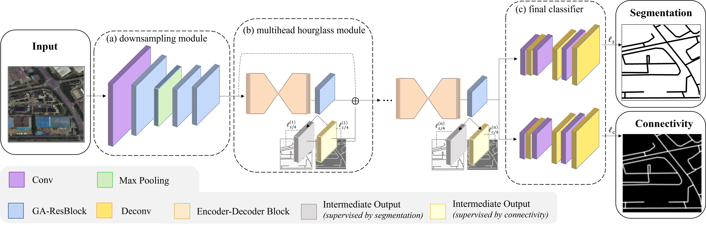

# SITS-MoCo

PyTorch implementation of  ["Fine–Grained Extraction of Road Networks via Joint Learning of Connectivity and Segmentation"]()



**Abstract:** Road network extraction from satellite images is widely applicated in intelligent traffic management and autonomous driving fields. The high-resolution remote sensing images contain complex road areas and distracted background, which make it a challenge for road extraction. In this study, we present a stacked multitask network for end-to-end segmenting roads while preserving connectivity correctness. In the network, a global-aware module is introduced to enhance pixel-level road feature representation and eliminate background distraction from overhead images; a road-direction-related connectivity task is added to ensure that the network preserves the graphlevel relationships of the road segments. We also develop a stacked multihead structure to jointly learn and effectively utilize the mutual information between connectivity learning and segmentation learning. We evaluate the performance of the proposed network on three public remote sensing datasets. The experimental results demonstrate that the network outperforms the state-of-the-art methods in terms of road segmentation accuracy and connectivity maintenance.

## Requirements

* Python 3.6, PyTorch 1.2, and more in `environment.txt`

## Usage

Example: train the model with the example dataset (dataset/toy-spacenet) and configuration file (config.json)

```
python train.py -c config.json
```

## Reference

In case you find the code useful, please consider citing our paper using the following BibTex entry:

```
xxx
```

## Credits

- The implementation is based on  [pytorch template](https://github.com/victoresque/pytorch-template) by [Victor Huang](https://github.com/victoresque).

- The SpaceNet 3 Road Network Detection datasets were accessed from the [SpaceNet 3: Road Network Detection](https://spacenet.ai/spacenet-roads-dataset/).
